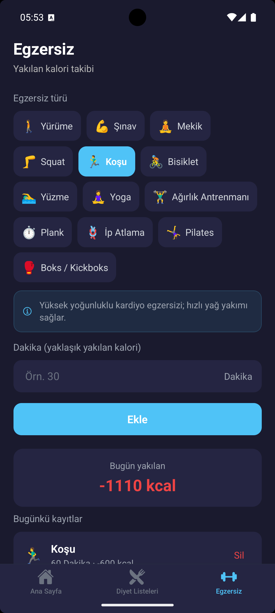
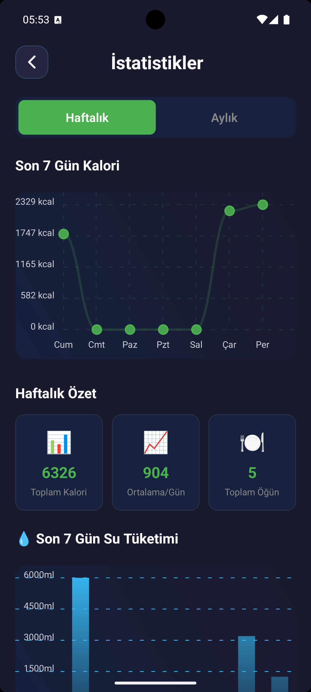
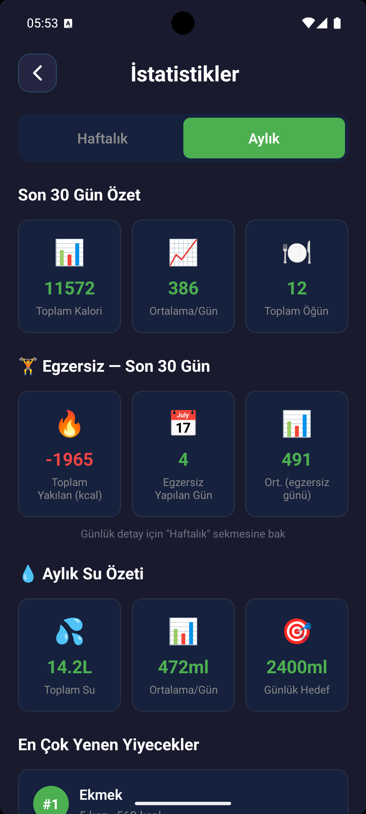
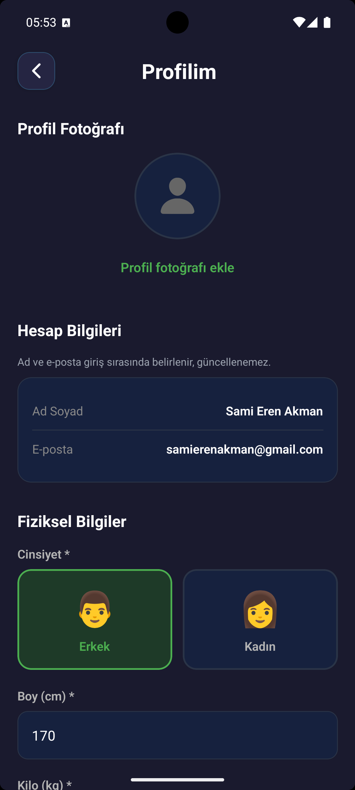

# 🍎 CaloCam - Kalori Takip Uygulaması

Modern ve kullanıcı dostu bir kalori takip uygulaması. React Native (Expo) ve Firebase ile geliştirilmiştir.

## 📱 Özellikler

### ✅ Tamamlanan Özellikler:
- ✅ Modern ve karanlık tema tasarımı
- ✅ Hoş geldin ekranı
- ✅ Email/Password ile kayıt olma
- ✅ Email/Password ile giriş yapma
- ✅ Google ile giriş yapma (yapılandırma gerekli)
- ✅ Firebase Authentication entegrasyonu
- ✅ Firestore veritabanı entegrasyonu
- ✅ Kullanıcı verilerinin güvenli saklanması
- ✅ AI destekli yemek kalori tespiti
- ✅ Barkod okuyucu ve USDA veritabanı entegrasyonu
- ✅ Gelişmiş kalori, makro ve su takibi
- ✅ Diyet listeleri ve hazır öğün planlama
- ✅ Günlük egzersiz takibi
- ✅ Profil fotoğrafı yükleme ve hesap yönetimi

## 📸 Ekran Görüntüleri

<div align="center">
  <table>
    <tr>
      <td align="center">
        <b>Hoş Geldin / Açılış</b><br/>
        
      </td>
      <td align="center">
        <b>Ana Sayfa</b><br/>
        
      </td>
      <td align="center">
        <b>Ana Sayfa (Alternatif)</b><br/>
        
      </td>
    </tr>
    <tr>
      <td align="center">
        <b>Öğün Ekle (AI & Barkod)</b><br/>
        
      </td>
      <td align="center">
        <b>AI Kalori Detayları</b><br/>
        
      </td>
      <td align="center">
        <b>AI Kalori Detayları 2</b><br/>
        
      </td>
    </tr>
    <tr>
      <td align="center">
        <b>Hazır Öğünler</b><br/>
        
      </td>
      <td align="center">
        <b>Diyet Listeleri</b><br/>
        
      </td>
      <td align="center">
        <b>Egzersiz Takibi</b><br/>
        
      </td>
    </tr>
    <tr>
      <td align="center">
        <b>İstatistikler (Günlük)</b><br/>
        
      </td>
      <td align="center">
        <b>İstatistikler (Haftalık)</b><br/>
        
      </td>
      <td align="center">
        <b>Profil Ayarları</b><br/>
        
      </td>
    </tr>
  </table>
</div>

## 🚀 Kurulum

### 1. Projeyi İndirin
```bash
git clone [repo-url]
cd CaloCam
```

### 2. Bağımlılıkları Yükleyin
```bash
npm install
```

### 3. Firebase Kurulumu
**Detaylı kurulum için:** [FIREBASE_SETUP.md](./FIREBASE_SETUP.md) dosyasına bakın.

**Kısaca:**
1. https://console.firebase.google.com/ adresine gidin
2. "CaloCam" adında yeni proje oluşturun
3. Authentication'ı etkinleştirin (Email/Password ve Google)
4. Firestore Database oluşturun
5. Config bilgileriniz zaten `config/firebase.js` dosyasına eklenmiş

### 4. Uygulamayı Çalıştırın
```bash
npx expo start
```

Android emülatörde çalıştırmak için:
```bash
npx expo start --android
```

## 📂 Proje Yapısı

```
CaloCam/
├── screens/               # Uygulama Ekranları
│   ├── AddMealScreen.js
│   ├── CreateReadyMealScreen.js
│   ├── DashboardScreen.js
│   ├── DietDetailScreen.js
│   ├── DietListsScreen.js
│   ├── ExerciseScreen.js
│   ├── LoginScreen.js
│   ├── MealDetailScreen.js
│   ├── OnboardingScreen.js
│   ├── ProfileScreen.js
│   ├── SignupScreen.js
│   ├── StatsScreen.js
│   └── WelcomeScreen.js
├── components/            # Tekrar Kullanılabilir Bileşenler
│   ├── CustomAlert.js
│   ├── GoogleIcon.js
│   └── ReadyMealsModal.js
├── services/              # API ve İş Mantığı Servisleri
│   ├── authService.js
│   ├── dietService.js
│   ├── exerciseService.js
│   ├── foodAIService.js
│   ├── geminiVisionService.js
│   ├── mealService.js
│   ├── notificationService.js
│   ├── openFoodFactsService.js
│   ├── profilePhotoService.js
│   ├── readyMealService.js
│   ├── statsService.js
│   ├── usdaFoodService.js
│   └── waterService.js
├── context/               # Global Context ve State Yönetimi
│   └── AlertContext.js
├── config/                # Yapılandırma Dosyaları
│   └── firebase.js
├── utils/                 # Yardımcı Fonksiyonlar ve Validasyonlar
│   └── validation.js
├── data/                  # Statik Veri Modelleri
├── screenshots/           # Uygulama Ekran Görüntüleri
├── App.js                 # Ana Uygulama ve Route (Navigation)
└── package.json           # Proje Bağımlılıkları
```

## 🎨 Tasarım

- **Renk Paleti:**
  - Ana arka plan: `#1a1a2e` (Koyu lacivert)
  - İkincil arka plan: `#16213e` (Lacivert)
  - Vurgu rengi: `#4CAF50` (Yeşil)
  - Metin: `#ffffff` (Beyaz) ve `#b4b4b4` (Gri)

- **Tipografi:**
  - Başlıklar: Bold, 32-48px
  - Gövde metni: Regular, 14-18px

## 🔐 Güvenlik

- Firebase config dosyası `.gitignore`'a eklenmiştir
- Firestore veritabanı kuralları ile kullanıcıların kişisel hesap ve sağlık verileri (öğünler, su, egzersiz) sadece kendilerine özel tutulmuştur. Ancak, tüm kullanıcıların faydalanabilmesi için genel veya hazır diyet listeleri gibi ortak verilere herkesin okuma izni bulunmaktadır.
- Şifreler Firebase Authentication tarafından güvenli şekilde saklanır

## 🛠️ Teknolojiler

- **React Native** (Expo SDK 54)
- **Firebase** (Authentication + Firestore)
- **React Navigation** (Native Stack)
- **Expo Vector Icons**

## ⚖️ Lisans

Bu proje **MIT** lisansı ile korunmaktadır. Daha fazla bilgi için [LICENSE](LICENSE) dosyasına göz atabilirsiniz.

---

## 👨‍💻 Geliştirici

**CaloCam** projesi, kullanıcıların beslenme alışkanlıklarını kolayca takip edebilmesi için geliştirilmiştir.

<table border="0">
  <tr>
    <td>
      <strong>SeAkman</strong><br />
      <em>Bilgisayar Programcılığı Öğrencisi</em><br />
      <a href="https://github.com/SeAkman0">
        
      </a>
      <a href="https://www.linkedin.com/in/sami-eren-akman-559561299/">
        
      </a>
    </td>
  </tr>
</table>

<p align="center">
  <small>© 2026 CaloCam - Tüm hakları saklıdır.</small>
</p>
